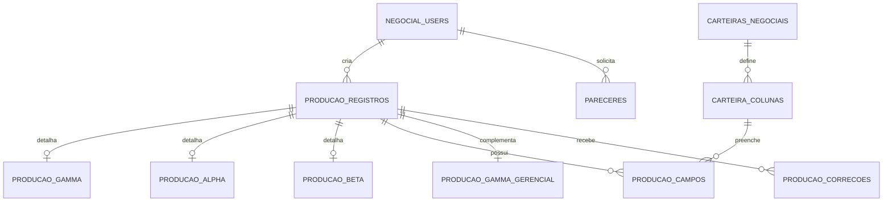

# Arquitetura do Banco de Dados

Este documento descreve o estado atual do banco `projeto_negocial`.

## Organizacao Atual

O PostgreSQL usa dois schemas principais:

- `gerencial`: backoffice, monitoramento, overview, protocolos, colchao e auditoria.
- `negocial`: login dos negociadores, producao diaria, pareceres e carteiras negociais.

Essa separacao deve ser mantida.

## Classificacao das Tabelas

### Gerencial

| Tabela | Status | Uso |
| --- | --- | --- |
| `gerencial.users` | Ativa | Usuarios gerenciais |
| `gerencial.sessions` | Manutencao | Sessoes gerenciais |
| `gerencial.negociadores` | Ativa | Cadastro de negociadores por planilha ou sistema |
| `gerencial.carteiras` | Ativa | Carteiras do backoffice |
| `gerencial.events` | Ativa | Eventos de timeline/overview |
| `gerencial.snapshots` | Historico pesado | Snapshots completos das planilhas/sistema |
| `gerencial.overview_reads` | Manutencao | Controle de leitura do overview por usuario |
| `gerencial.notification_reads` | Manutencao | Notificacoes dispensadas |
| `gerencial.notes` | Ativa | Observacoes |
| `gerencial.protocolos` | Ativa | Controle de protocolo migrado para banco |
| `gerencial.colchao_alpha` | Ativa | Colchao Alpha |
| `gerencial.colchao_beta` | Ativa | Colchao Beta |
| `gerencial.database_health_snapshots` | Observabilidade | Saude, conexoes e performance |
| `gerencial.database_table_growth_snapshots` | Observabilidade | Crescimento por tabela |
| `gerencial.db_retention_policies` | Governanca | Politicas de retencao |
| `gerencial.data_quality_issues` | Governanca | Inconsistencias para saneamento |

### Negocial

| Tabela | Status | Uso |
| --- | --- | --- |
| `negocial.users` | Ativa | Usuarios negociadores |
| `negocial.sessions` | Manutencao | Sessoes negociais |
| `negocial.pareceres` | Ativa | Pareceres solicitados pelo negocial |
| `negocial.carteiras_negociais` | Ativa | Cadastro dinamico de carteiras |
| `negocial.carteira_colunas` | Ativa | Colunas de cada carteira |
| `negocial.producao_registros` | Alvo | Base unica da producao diaria |
| `negocial.producao_gamma` | Alvo | Campos especificos do GAMMA |
| `negocial.producao_alpha` | Alvo | Campos especificos da Alpha |
| `negocial.producao_beta` | Alvo | Campos especificos da Beta |
| `negocial.producao_campos` | Preparada | Campos dinamicos para novas carteiras |
| `negocial.producao_gamma_gerencial` | Ativa | Complementos gerenciais do GAMMA |
| `negocial.producao_correcoes` | Ativa | Correcoes feitas pelo backoffice |
| `negocial.alembic_version` | Tecnica | Controle oficial das migrations |
| `negocial.schema_migrations_meta` | Tecnica | Historico auxiliar das migrations |

`negocial.producao_diaria` e `negocial.producao_diaria_legacy` nao fazem mais parte do schema operacional.

## Modelo Atual da Producao

```text
producao_registros
  |-- producao_gamma
  |-- producao_alpha
  |-- producao_beta
  |-- producao_campos
  |-- producao_gamma_gerencial
  `-- producao_correcoes
```

Regras:

- `producao_registros` guarda os campos comuns.
- `producao_gamma`, `producao_alpha` e `producao_beta` guardam campos especificos das carteiras padrao.
- `producao_campos` guarda dados de carteiras dinamicas criadas pelo gerencial.
- Leituras consolidadas devem usar a view `negocial.producao_unificada`.
- Mudancas estruturais novas devem ser feitas por Alembic migrations.

## ERD Resumido



## Politica de Manutencao

O sistema possui endpoints administrativos:

- `GET /api/database/inventory`
  - Lista tabelas, status, linhas, tamanho e recomendacoes.

- `POST /api/database/maintenance`
  - Executa manutencao em `dry_run` por padrao.

Payload recomendado para simulacao:

```json
{
  "dry_run": true,
  "snapshot_retention_days": 120,
  "snapshot_delete_limit": 5000,
  "read_retention_days": 180,
  "session_retention_days": 7
}
```

Payload para aplicar:

```json
{
  "dry_run": false,
  "snapshot_retention_days": 120,
  "snapshot_delete_limit": 5000,
  "read_retention_days": 180,
  "session_retention_days": 7
}
```

## Retencao de Snapshots

Snapshots podem crescer rapidamente. A limpeza segura remove apenas snapshots que:

- sao mais antigos que a politica configurada;
- nao estao referenciados por eventos;
- nao sao o ultimo snapshot do mes por negociador/sheet.

Isso preserva timeline, detalhes de alteracoes e consulta historica mensal.

## Documentos operacionais

- `database-model.md`: modelo formal e relacionamentos.
- `database-observability.md`: coleta, alertas e crescimento.
- `disaster-recovery.md`: backup, ensaio isolado e recuperacao real.

## Rotina recomendada

1. Criar migrations formais antes de mudancas no schema negocial.
2. Executar manutencao em `dry_run` antes de aplicar limpeza real.
3. Revisar alertas e crescimento semanalmente.
4. Executar ensaio de restauracao mensalmente.
