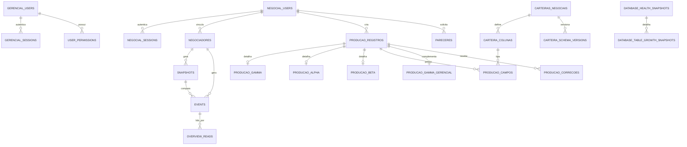

# Modelo Formal do Banco de Dados

Atualizado em 2026-07-20. A fonte operacional e o PostgreSQL `projeto_negocial`.

## Limites de dominio

- `gerencial`: backoffice, monitoramento, auditoria, protocolos, colchao, usuarios gerenciais e governanca.
- `negocial`: usuarios negociadores, producao, pareceres, carteiras dinamicas, fechamento mensal e auditoria negocial.
- Integracoes entre os sistemas usam chaves reais quando possivel. `gerencial.negociadores.negocial_user_id` referencia `negocial.users.id`.

## Entidades gerenciais

| Entidade | Responsabilidade | Retencao |
| --- | --- | --- |
| `users`, `sessions` | Autenticacao gerencial | Sessoes expiradas: 7 dias |
| `role_permissions`, `user_permissions` | Permissoes por perfil e excecoes individuais | Permanente |
| `negociadores`, `carteiras` | Cadastro e vinculo com o sistema negocial | Permanente |
| `snapshots`, `events` | Versionamento e delta do monitoramento | Snapshots elegiveis: 120 dias |
| `overview_reads`, `notification_reads` | Estado individual de leitura | 180 dias |
| `general_audit` | Auditoria geral do backoffice | 365 dias |
| `protocolos` | Controle de protocolos | Permanente |
| `colchao_alpha`, `colchao_beta` | Parcelas e status do colchao | Permanente |
| `notes` | Observacoes de entidades | Permanente |
| `db_retention_policies` | Politicas operacionais de retencao | Permanente |
| `data_quality_issues` | Fila de inconsistencias detectadas | Conforme resolucao |
| `database_health_snapshots` | Historico de saude do PostgreSQL | 90 dias |
| `database_table_growth_snapshots` | Crescimento por tabela | 90 dias, em cascata |

## Entidades negociais

| Entidade | Responsabilidade |
| --- | --- |
| `users`, `sessions` | Autenticacao dos negociadores |
| `permission_profiles` | Ferramentas e permissoes do negocial |
| `carteiras_negociais` | Carteiras configuraveis |
| `carteira_colunas` | Schema visual e regras de cada carteira |
| `carteira_schema_versions` | Historico de alteracoes dos schemas |
| `producao_registros` | Campos comuns e identidade de cada acordo |
| `producao_gamma`, `producao_alpha`, `producao_beta` | Campos especificos das carteiras padrao |
| `producao_campos` | Valores tipados das carteiras dinamicas |
| `producao_gamma_gerencial` | Complementos gerenciais do GAMMA |
| `producao_correcoes` | Correcoes e notificacoes do backoffice |
| `pareceres` | Solicitacoes, aprovacao e decisao de parecer |
| `fechamento_mensal` | Competencias fechadas e bloqueios de edicao |
| `operational_versions` | Versoes leves para sincronizacao e cache |
| `audit_logs` | Auditoria negocial |
| `db_retention_policies`, `data_quality_issues` | Governanca e saneamento |
| `alembic_version`, `schema_migrations_meta` | Controle de migrations |

## Relacionamentos

## Regras de integridade

- Um campo dinamico usa no maximo um armazenamento tipado: texto, numero, data ou JSON.
- Valores monetarios operacionais nao podem ser negativos.
- Colunas de carteira aceitam apenas etapas 1 ou 2 e limite de caracteres positivo.
- Percentuais de honorarios nao podem ser negativos; minimo nao pode superar maximo.
- Eventos nao podem ter quantidade negativa de alteracoes.
- Negociadores usam origem `planilha` ou `sistema`.
- Protocolos usam `PENDENTE` ou `CONCLUIDO`.
- Mudancas no schema `negocial` devem ser feitas por migration Alembic.

## Fonte de leitura

A producao consolidada deve ser lida pela view `negocial.producao_unificada` ou pelos repositories de dominio. Codigo de interface nao deve montar joins diretamente.
